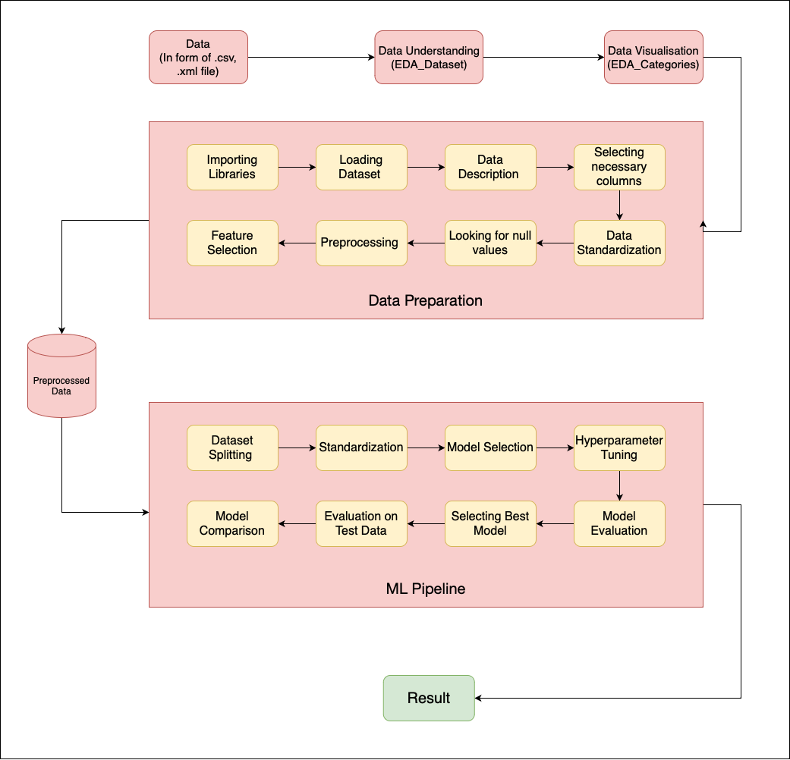
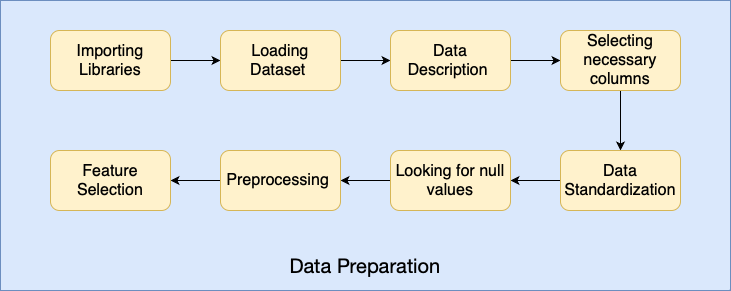
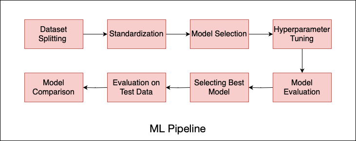

# digital Marketing Analysis

# Introduction

In the world of digital marketing, the success of campaigns depends on various performance metrics. This dataset combines quantitative measures like impressions and engagements with creative details such as headlines, calls-to-action, images, and offers. We're on a journey to explore this dataset, uncovering trends and connections to understand how creative elements impact campaign success. By carefully preparing the data, building models, and evaluating results, our goal is to create a predictive model that can forecast campaign performance. The insights and recommendations from this exploration will be a guide for future digital marketing efforts. This repository provides a detailed investigation, offering a clearer picture of how creative ideas and campaign success go hand in hand.

# Project Pipeline

# Table of Contents

## [ 1. Dataset description ](#1-dataset-description)
## [ 2.  Data Preprocessing ](#2-data-preprocessing)
## [ 3. EDA ](#3-eda)
## [ 4. MODEL BUILDING ](#4-model-building\)
## [ 5. Result ](#5-result)

## 1. Dataset description

attributes:

'date' : The timestamp when the data was recorded.

'company_name' : The name of the company conducting the digital marketing campaign.

'spend' : The amount of money spent on the campaign.

'impressions' : The number of times the campaign content was displayed.

'likecount' : The count of likes received on the campaign.

'commentcount' : The count of comments received on the campaign.

'repostcount' : The count of times the campaign content was reposted or shared.

'total_engagements' : The overall engagement metric, combining likes, comments, and reposts.

'conversion' : Metric indicating the conversion rate, possibly the percentage of users who took a desired action.

'action_type' : The type of action users took in response to the campaign.

'post_url' : The URL associated with the campaign post.

'post_content' : The textual content or description of the campaign post.

'profile_url' : The URL of the company's profile associated with the campaign.

'video_url' : The URL if the campaign includes a video.

'shared_post_url' : The URL if the campaign post was shared.

'created_at' : The timestamp indicating when the campaign was created.

'size' : The size or dimensions of the campaign content.

'url' : The URL associated with the campaign.

'number_of_faces' : The count of faces detected in the campaign content.

'face_emotion' : The emotional expression detected on faces in the campaign.

'face_position' : The position or location of faces in the campaign content.

'face_area_percentage' : The percentage of the image occupied by faces.

'objects' : Types of objects detected in the campaign content.

'number_of_objects' : The count of objects detected in the campaign.

'primary_object' : The primary object identified in the campaign content.

'primary_object_position' : The position or location of the primary object.

'primary_object_area_percentage' : The percentage of the image occupied by the primary object.

'secondary_object' : The secondary object identified in the campaign content.

'secondary_object_position' : The position or location of the secondary object.

'secondary_object_area_percentage' : The percentage of the image occupied by the secondary object.

'text' : Textual content in the campaign.

'text_length' : The length of the text in characters.

'dominant_colour' : The dominant color in the campaign content.

'cta' : Call-to-action associated with the campaign.

'logos' : Presence or absence of logos in the campaign.

'logo_1_name' : The name of the first logo identified.

'logo_1_position' : The position of the first logo in the campaign.

'logo_1_area_percentage' : The percentage of the image occupied by the first logo.

'logo_2_name' : The name of the second logo identified.

'logo_2_position' : The position of the second logo in the campaign.

'logo_2_area_percentage' : The percentage of the image occupied by the second logo.

'number_of_persons' : The count of persons detected in the campaign content.

'person_area_percentage' : The percentage of the image occupied by persons.

'person_area' : The area occupied by persons in the image.

'style' : The style of the campaign (e.g., Modern, Elegant).

'tone' : The tone of the campaign content (e.g., Informative, Inspirational).

'voice' : The voice or tone used in the campaign (e.g., Friendly, Professional).

'sentiment' : The sentiment associated with the campaign (e.g., Positive, Neutral).

'text_area_percentage' : The percentage of the image occupied by text.

'empty_space_percentage' : The percentage of empty space in the image.

'topic' : The topic or subject matter of the campaign.

'language' : The language used in the campaign.

'#faces', '#persons', '#objects', '#text_length' : Counts representing the number of faces, persons, objects, and the length of text.

## 2. Data Preprocessing  

-In the data preprocessing phase, several steps were taken to ensure the dataset's quality and relevance for subsequent modeling:

#### Handling Missing Values:

-Identified and dropped less relevant columns such as 'videourl,' 'sharedposturl,' 'logos,' 'objects,' 'url,' and 'text.'
-Imputed missing values in specific columns with the label 'unknown' to maintain dataset integrity. These columns include 'logo 2 name,' 'logo 2 position,' 'style,' 'face emotion,' 'face position,' 'sentiment,' 'logo 1 position,' 'secondary object position,' 'secondary object,' 'primary object position,' 'primary object,' 'person area %,' '# text length,' and 'cta.'

#### Imputation for Specific Columns:

-For columns like 'logo 2 name,' 'logo 2 position,' 'style,' 'face emotion,' 'face position,' 'sentiment,' 'logo 1 position,' 'secondary object position,' 'secondary object,' 'primary object position,' 'primary object,' 'person area %,' '# text length,' and 'cta,' missing values were filled with appropriate labels like 'No Logo,' 'No Position,' 'No style,' 'Unknown,' etc.

#### Drop Highly Positively Correlated Columns:

-To enhance model efficiency and prevent multicollinearity, columns that were highly positively correlated were identified and removed. This was done to streamline the dataset, focusing on essential features for subsequent modeling.

These preprocessing steps aim to create a more refined dataset, ensuring it contains pertinent information for the modeling phase while addressing missing values appropriately and optimizing feature relevance.

## 3. EDA

### Summary of Key Findings:

#### Correlation Analysis:

-Spend and impressions exhibit a positive correlation.
-Total engagement and like count are positively correlated.
-Conversion is positively correlated with like count and moderately positively correlated with total engagements.

#### Content Type and Engagement:

"Article" content garners the highest average engagements, followed by "document" and "video (LinkedIn source)."
Lower average engagement is observed for "text," "image," and "video (external source)," with the least engagement found in "polls."

#### Primary Object Position and Engagement:

-The bottom center position yields the highest average engagements.
-Subsequently, positions at the center and top-left also contribute to significant engagement.
-Moderate engagements are observed for center-left, top-center, and bottom-right positions.
-Center-right and top-right positions result in lower average engagements.

#### Empty Space Percentage and Engagement:

-The highest average engagement occurs in the small percentage area, followed by larger and medium-sized areas.
-The 10 to 20 percent empty space range shows the highest average engagement, exceeding 300.
-Engagement is around 270 for less than 10 percent, drops to 200 for over 40 percent, and remains below 200 in the 20 to 40 percent range.

#### Number of Objects and Engagement:

-Highest average engagement is observed when there is only 1 object.
-Engagements decrease in the order: 5 or more objects, 2 to 4 objects, and 0 objects.
-In descending order, the corresponding average engagement values are 250, 245, and 160.
pThese findings provide a comprehensive understanding of engagement patterns across various factors. They can be instrumental in optimizing content strategies and placements for enhanced user interaction.

## 4. MODEL BUILDING

#### Feature Engineering and Model Building:
For feature engineering, we utilized a function (show_collinear_features) to identify and drop highly correlated features based on a given threshold. Following that, the data was split into training and testing sets, scaled, and fitted.

We employed various regression models for prediction, and the model hyperparameters were tuned using a grid search approach. The models included:

Linear Regression
Random Forest Regressor
XGBoost Regressor
Support Vector Machine (SVM)
Decision Tree Regressor

## 5. Result
We evaluated each model's performance using the following metrics for each target variable (likecount, commentcount, repostcount, total engagements, conversion):

Root Mean Squared Error (RMSE): Measures the average magnitude of the errors.
Mean Absolute Error (MAE): Represents the average absolute differences between predicted and actual values.
R-squared (R2): Indicates the proportion of the variance in the dependent variable that is predictable from the independent variable.

#### Like Count:
Best Model: RandomForestRegressor

#### Recommendation: 
RandomForestRegressor is the preferred model for predicting 'likecount.'

#### Comment Count:
Best Model: RandomForestRegressor (RMSE, MAE) and XGBRegressor (R2 Score)

#### Repost Count:
Best Model: RandomForestRegressor

#### Total Engagements:
Best Model: RandomForestRegressor

#### Conversion:
Best Model: RandomForestRegressor

-XGBRegressor:
-R2 Score: Best on the train set

#### Overall Result:
Best Overall Model: RandomForestRegressor

#### Consistency: 
Demonstrates consistent superior performance across all target variables.
Recommendation: RandomForestRegressor is the most reliable and robust model for predicting engagement metrics in this context.
Strong Contender: XGBRegressor

Strength: Particularly notable for 'commentcount.'
Linear Regression:

Performance: Performs reasonably well but is generally outperformed by RandomForestRegressor and XGBRegressor.
These results guide the selection of the most suitable models for each target variable, providing insights into their individual and overall performances.

